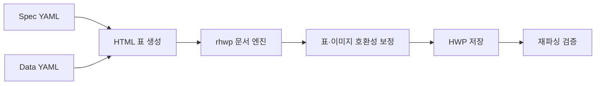

# hwp-maker

> YAML 사양으로 표와 이미지를 포함한 HWP 문서를 만들고, 읽고, 수정하고, 삭제하는 Rust CLI·라이브러리

`hwp-maker`는 반복해서 작성하는 현장 문서와 보고서 양식을 코드로 관리하기 위해 만든 프로젝트입니다. 표의 크기, 셀 스타일, 텍스트와 이미지를 YAML로 정의하면 `.hwp` 파일을 생성하며, 기존 문서의 구조 조회와 텍스트 치환, 표 요소 삭제도 지원합니다.

HWP 엔진은 [edwardkim/rhwp](https://github.com/edwardkim/rhwp)를 사용합니다. 엔진의 HTML 가져오기·네이티브 저장 경로에서 발견한 호환성 문제를 보정해, 생성 결과가 한컴독스에서 열리고 다시 파싱되는 것까지 확인했습니다.

- [빠른 시작](#빠른-시작)
- [YAML 예제](#yaml-예제)
- [기술 구현 가이드](docs/PORTABLE_GUIDE.md)

## 해결하려는 문제

HWP 문서를 자동화할 때는 단순 텍스트 치환만으로 부족한 경우가 많습니다.

- 표의 행·열과 병합 셀을 코드로 정의해야 한다.
- 출력 문서에서도 셀과 이미지 크기가 정확해야 한다.
- 템플릿과 데이터를 분리해 같은 양식을 반복 사용해야 한다.
- 생성한 파일이 실제 HWP 뷰어에서 열리고 다시 읽혀야 한다.

`hwp-maker`는 YAML을 문서의 원본 사양으로 사용하고, 생성 후 호환성 보정과 재파싱 검증을 수행하는 방식으로 이 문제를 해결합니다.

## 핵심 기능

| 기능 | 명령 | 지원 범위 |
| --- | --- | --- |
| 문서 생성 | `build` | 표, 병합 셀, 텍스트 스타일, 이미지, pt 단위 크기 |
| 데이터 적용 생성 | `build --data` | 텍스트·이미지 placeholder를 실제 값으로 렌더링 |
| 템플릿 채우기 | `fill` | 기존 HWP의 텍스트 placeholder 치환 |
| 구조 조회 | `read` | section, paragraph, table, cell, BinData를 JSON으로 출력 |
| 빠른 점검 | `inspect` | 문서의 section·paragraph 요약 |
| 구조 삭제 | `delete` | 행, 열, 표, 셀 내부 이미지 삭제 |

CLI와 같은 기능을 Rust 라이브러리 API로도 제공합니다.

## 작동 방식



1. YAML 사양을 읽어 표와 셀 스타일을 HTML로 변환합니다.
2. `rhwp`의 문서 엔진으로 빈 HWP 문서에 표와 이미지를 삽입합니다.
3. 한컴독스 호환에 필요한 Table·Picture·BinData 구조를 보정합니다.
4. 저장한 바이트를 다시 파싱해 구조가 유효한지 확인합니다.

## 빠른 시작

Rust와 `cargo`가 필요합니다.

```bash
git clone https://github.com/0xMegg/hwp-maker.git
cd hwp-maker
cargo build
```

예제 사양과 데이터를 사용해 HWP 문서를 생성합니다.

```bash
# placeholder가 들어 있는 템플릿 생성
cargo run -- build \
  --spec examples/minimal_table.yaml \
  --out out/template.hwp

# 텍스트와 이미지를 적용한 완성본 생성
cargo run -- build \
  --spec examples/minimal_table.yaml \
  --data examples/fill_data.yaml \
  --out out/filled.hwp

# 생성 결과의 구조 확인
cargo run -- read --file out/filled.hwp
```

### 기존 템플릿 채우기

`fill`은 기존 HWP 템플릿의 `{{key}}` 텍스트를 데이터 값으로 교체합니다.

```bash
cargo run -- fill \
  --template out/template.hwp \
  --data examples/fill_data.yaml \
  --out out/filled-via-template.hwp
```

이미지를 새로 넣거나 교체해야 할 때는 `fill` 대신 `build --data`를 사용합니다.

### 문서 요소 삭제

```bash
# 첫 번째 표에서 두 번째 행 삭제
cargo run -- delete row \
  --file out/filled.hwp --table 0 --index 1 \
  --out out/without-row.hwp

# 첫 번째 표의 네 번째 셀에서 이미지 삭제
cargo run -- delete picture \
  --file out/filled.hwp --table 0 --cell 3 \
  --out out/without-picture.hwp
```

행·열·표·셀 인덱스는 0부터 시작합니다. `read` 결과로 문서 구조와 대상 인덱스를 먼저 확인할 수 있습니다.

## YAML 예제

문서의 레이아웃은 Spec YAML, 실제 값은 Data YAML로 분리합니다.

### Spec YAML

```yaml
version: 1
vars:
  project_name: "현장 기록"
table:
  border: { style: solid, width_pt: 0.5, color: "#000000" }
  cell_padding_pt: 4
  columns:
    - { width_pt: 120 }
    - { width_pt: 260 }
  rows:
    - { height_pt: 28 }
    - { height_pt: 96 }
  cells:
    - row: 0
      col: 0
      colspan: 2
      text: "{{project_name}}"
      style: { size_pt: 14, weight: bold, align: center, bg: "#EEEEEE" }
    - row: 1
      col: 0
      text: "촬영일자"
      style: { align: center, weight: bold }
    - row: 1
      col: 1
      text: "{{date}}"
      placeholder: shoot_date
```

### Data YAML

```yaml
version: 1
fields:
  shoot_date: "2026-04-23 14:30"
```

이미지 필드는 파일 경로와 출력 크기를 함께 지정합니다.

```yaml
version: 1
fields:
  logo:
    image: "fixtures/logo.png"
    w_pt: 140
    h_pt: 80
```

## 라이브러리로 사용

다른 Rust 프로젝트에서 Git 의존성으로 추가할 수 있습니다.

```toml
[dependencies]
hwp-maker = { git = "https://github.com/0xMegg/hwp-maker", branch = "main" }
```

```rust
use std::path::Path;
use hwp_maker::{build, delete, read_as_json};

// YAML 사양으로 HWP 생성
build(
    Path::new("spec.yaml"),
    Some(Path::new("data.yaml")),
    Path::new("out.hwp"),
)?;

// 문서 구조 조회
let json = read_as_json(Path::new("out.hwp"))?;
println!("{json}");

// 첫 번째 표의 두 번째 행 삭제
delete::row(Path::new("out.hwp"), 0, 1, Path::new("without-row.hwp"))?;
```

저수준 기능이 필요하면 `hwp_maker::rhwp`로 기반 엔진에 직접 접근할 수 있습니다.

## 기술적 특징

### 정확한 크기 변환

HWP의 내부 단위인 HWPUNIT에 맞춰 표와 이미지 크기를 변환합니다.

- `1pt = 100 HWPUNIT`
- 이미지 입력은 96dpi 기준으로 pt와 px를 변환
- A4 기본 여백 기준 본문 폭은 약 425pt

### 한컴독스 호환성 보정

`rhwp`의 네이티브 저장 경로에서 표·이미지가 올바르게 열리지 않는 원인을 추적하고 다음 구조를 보정했습니다.

- Table `CommonObjAttr`
- Picture 배치 속성과 paragraph 구조
- 이미지 크기와 crop 정보
- DocInfo의 `BIN_DATA` manifest

발견한 문제와 구현 세부사항은 [기술 구현 가이드](docs/PORTABLE_GUIDE.md)에 정리되어 있습니다.

### 저장 후 재검증

문서를 저장한 뒤 같은 엔진으로 다시 파싱해 section과 paragraph 구조를 확인합니다. 테스트에서는 생성, 데이터 적용, 읽기, 텍스트 치환과 구조 삭제 경로를 실제 HWP 바이트로 검증합니다.

## 현재 한계

- `fill`은 텍스트 치환만 지원합니다. 이미지 갱신은 `build --data`로 문서를 다시 생성해야 합니다.
- 여러 문단으로 구성된 셀에서는 첫 번째 문단의 placeholder만 검사합니다.
- 대용량 이미지가 다수 포함된 문서는 기반 엔진의 CFB 직렬화 한계에 영향을 받을 수 있습니다.
- 폰트 결과는 실행 환경에 설치된 폰트에 따라 달라질 수 있습니다.

## 테스트

```bash
cargo test
```

테스트는 다음 흐름을 포함합니다.

- 템플릿 생성과 재파싱
- 데이터·이미지를 포함한 문서 생성
- 텍스트 placeholder 치환
- 표 구조와 BinData manifest 조회
- 행·열·표 삭제

## 프로젝트 배경과 출처

이 프로젝트는 [HOP](https://github.com/golbin/hop)가 사용하던 `rhwp` 버전을 기반으로 독립적인 CLI·라이브러리 계층을 구현한 것입니다. HOP 또는 `rhwp`의 포크가 아니며, HWP 엔진은 `Cargo.toml`에 특정 커밋으로 고정해 재현성을 유지합니다.

## License

[MIT](LICENSE)
